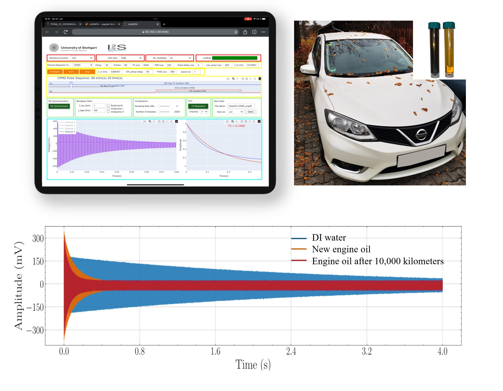
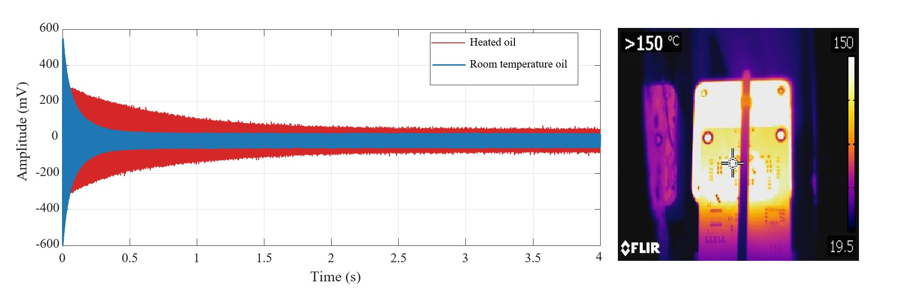

# PYNQ-Relaxation

## File Structure

#### docs: Documentations

#### boards: PYNQ-Z2, PYNQ-ZU, ZCU104 (including .bit .hwh .tcl File )

#### Jupyter notebook 

## Project Description 

## High-temperature relaxation test

High-temperature engine-oil relaxometry tests are used to simulate applications such as downhole oil-well logging. Because we do not have high-temperature-rated heavy rare-earth (HREE)–doped permanent magnets (e.g., Tb/Dy), we simulate the conditions by heating the chip, the front end, and the sample.

