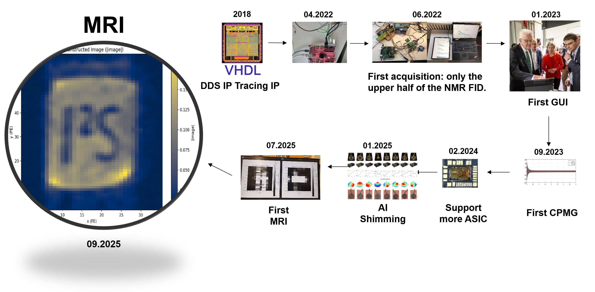
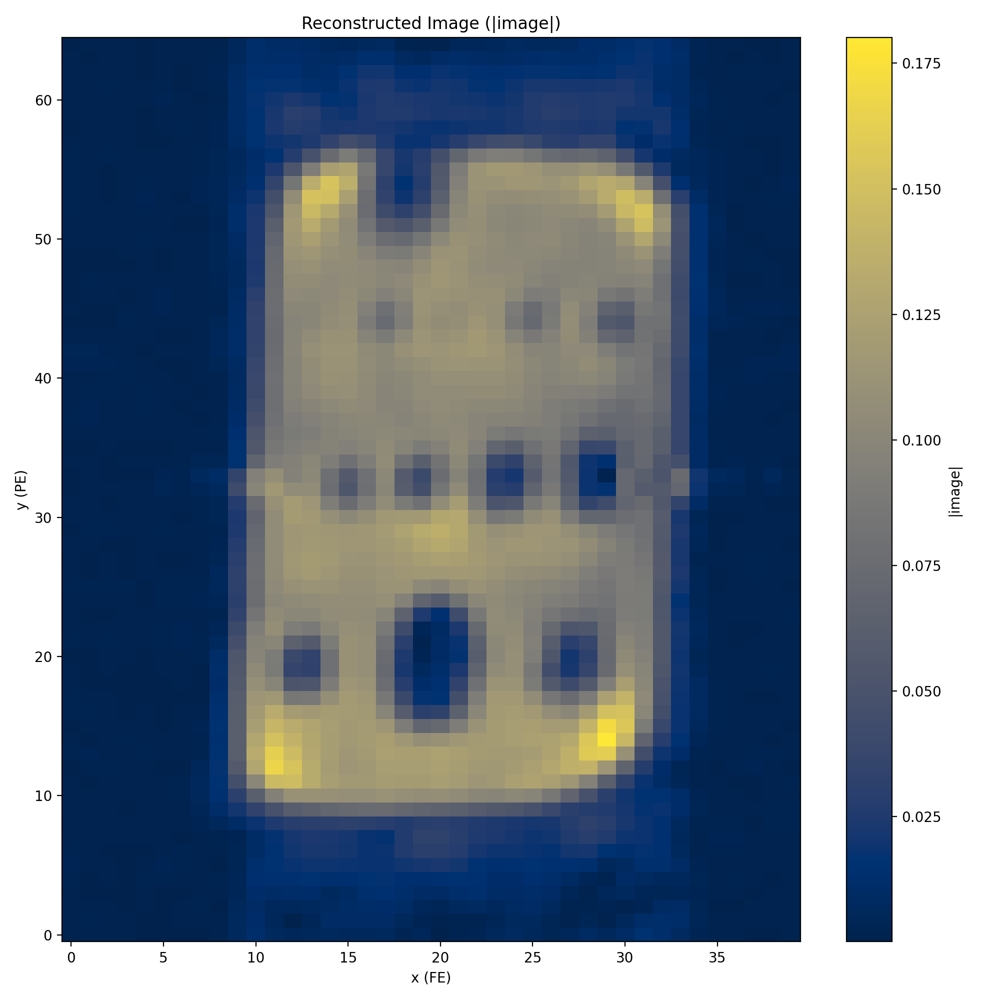
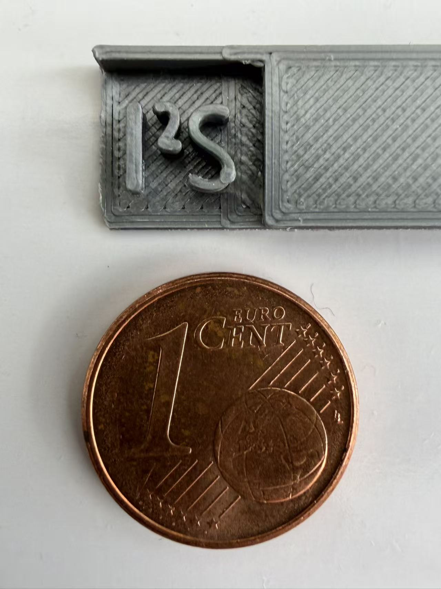
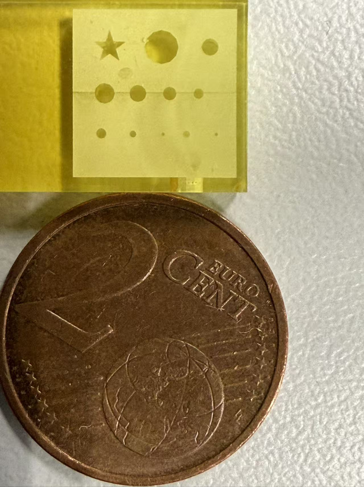

## History（A dream woven from DuPont jumper wires）
[](./history.md)

## MRI Demo Images (Proof-of-Function)

These images are **engineering demos** produced with the PYNQ-MRI platform to verify end-to-end functionality (pulse generation → gradient control → acquisition → reconstruction). They are **not** intended to claim high-resolution spectroscopic performance. Use them as a visual sanity check that the system, gradients, and reconstruction pipeline are wired correctly.

> Safety note (permanent magnets): keep ferromagnetic tools and loose metal away from the magnet gap; do not let objects snap into the poles.

### Gallery
<table>
  <tr>
    <td></td>
    <td></td>
    <td></td>
  </tr>
  <tr>
    <td></td>
    <td></td>
    <td></td>
  </tr>
</table>

### Physical Photos (real objects & scale)

<table>
  <tr>
    <td></td>
    <td></td>
  </tr>
  <tr>
    <td align="center"><sub>PLA 3D-printed phantom carrying raised I2S lettering — photo with 1-euro-cent (⌀ 16.25 mm) for scale</sub></td>
    <td align="center"><sub>BMF 3D-printed Test sample — photo with 2-euro-cent (⌀ 18.75 mm) for scale</sub></td>
  </tr>
</table>

### Acquisition (summary)

- Field & nucleus: low-field **¹H**; typical Larmor ≈ 15 MHz (exact values per image in the table below)
- Sequence: 2D Cartesian (spin-echo or gradient-echo as noted per image)
- Readout: standard Cartesian k-space, rectangular FOV, no partial Fourier
- Reconstruction: Hann window → optional zero-filling → 2D IFFT → magnitude → min-max normalization
- Purpose: exercise TX/RX chain, gradient linearity, and basic image formation under lab conditions

### Per-image metadata

Fill this table so users understand what each figure shows and can reproduce it.

| ID | File | Phantom / Content | Sequence | Matrix × FOV | Voxel (mm) | TE / TR (ms) | Averages | RX BW (kHz) | Notes |
|---:|------|-------------------|----------|--------------|------------|--------------|---------:|-------------:|------|
| 1 | `figures/mri_gallery/1.png` | Circular features | SE | `Nx×Ny` @ `Wx×Wy` mm | `Δx×Δy` | `TE` / `TR` | `NEX` | `BW` | e.g., slight ghosting along phase-encode |
| 2 | `figures/mri_gallery/2.png` | Rectangular plate w/ hole | GRE | … | … | … | … | … | … |
| 3 | `figures/mri_gallery/3.png` | 3×3 hole array | SE | … | … | … | … | … | checks resolution/MTF |
| 4 | `figures/mri_gallery/4.png` | Lettering (“IIS/IPS”) | GRE | … | … | … | … | … | orientation A |
| 5 | `figures/mri_gallery/5.png` | Dots + letters | SE | … | … | … | … | … | … |
| 6 | `figures/mri_gallery/6.png` | Lettering (“IIS/IPS”) | GRE | … | … | … | … | … | orientation B |

### File naming & sidecar metadata (recommended)

- **Filename pattern** (example):  
  `2025-11-03_phantom-IIS_seq-GRE_mat-128x128_fov-40x40mm_TE-6ms_TR-200ms_avg-4_bw-100kHz.png`
- Optional **JSON sidecar** for each image:
  ```json
  {
    "nucleus": "1H",
    "B0_T": 0.359,
    "larmor_Hz": 15280000,
    "sequence": "GRE",
    "matrix": [128, 128],
    "fov_mm": [40, 40],
    "voxel_mm": [0.3125, 0.3125],
    "TE_ms": 6,
    "TR_ms": 200,
    "averages": 4,
    "rx_bandwidth_kHz": 100,
    "window": "Hann",
    "zerofill": [256, 256],
    "recon_commit": "<git-short-sha>",
    "notes": "Orientation A; mild ringing on readout"
  }
