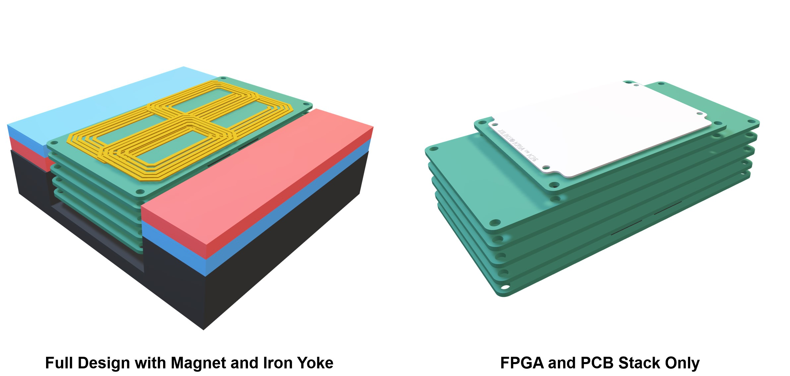
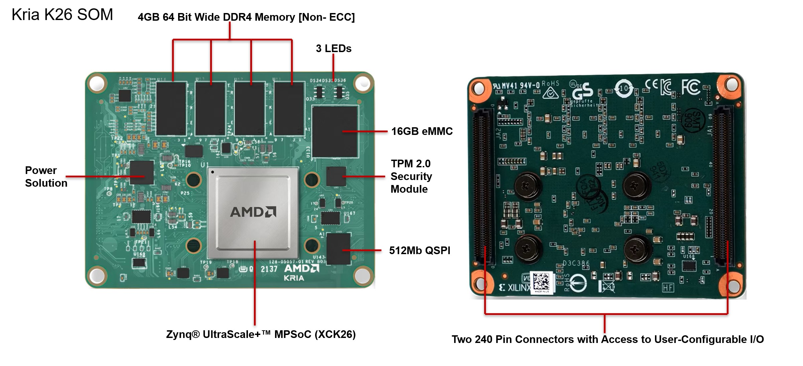
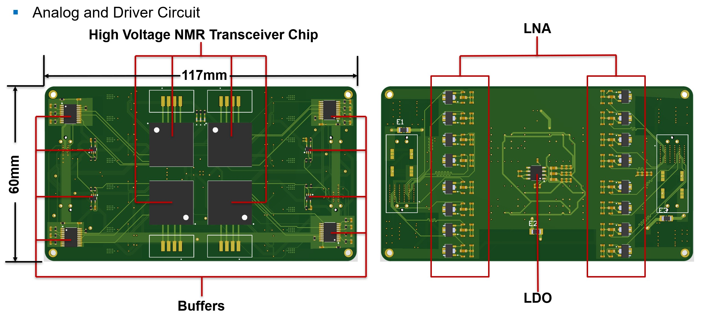
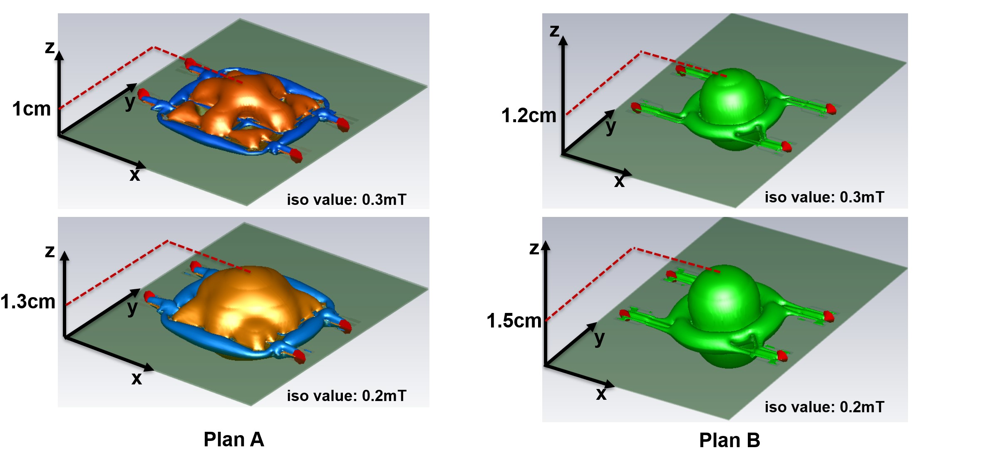
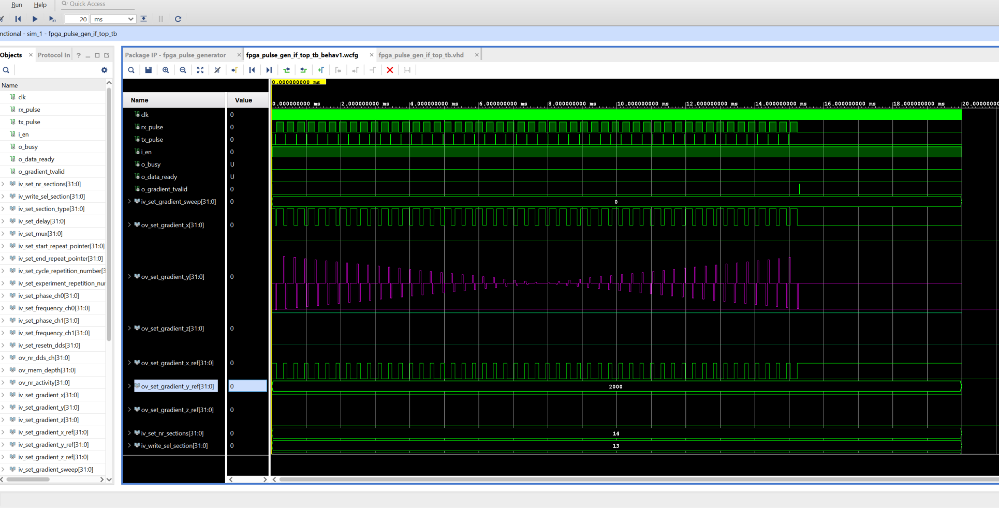

# Portable Quantum Experimental System Based on the PYNQ Platform

## Project Structure

##### PYNQ-Spectroscopy

##### PYNQ-Relaxometry

##### PYNQ-Magnet shimming

##### PYNQ-MRI

##### PYNQ-Mobile NMR Phased Array

##### PYNQ-Multi Channel

##### PYNQ-VCO NMR

##### PYNQ-ODMR

## Project Description 

This is a quantum experimentation project based on PYNQ (ZYNQ FPGA from AMD Xilinx) platform. It encompasses hardware circuit design, a graphical user interface (GUI), and several corresponding experiments. In the early stages of development, we employed a range of development platforms—including PYNQ-Z2, ZCU104, ZCU111, and the Kria K26 Som—to accommodate various application environments. The system is continuously updated on a regular basis.

Most of the setups in this project utilize ASICs developed by our team. However, we also provide alternative implementations that do not require ASICs.

If you require technical support, please feel free to contact me at [zhibin.zhao@iis.uni-stuttgart.de](mailto:zhibin.zhao@iis.uni-stuttgart.de), or my (former and always be) humble students [yitian.chen@iis.uni-stuttgart.de](mailto:yitian.chen@iis.uni-stuttgart.de) and [yichao.peng@iis.uni-stuttgart.de](mailto:yichao.peng@iis.uni-stuttgart.de).

For collaboration inquiries (regarding the chip or system), please contact Prof. Jens Anders at [jens.anders@iis.uni-stuttgart.de](mailto:jens.anders@iis.uni-stuttgart.de).

### Youtube Video

https://youtu.be/D55JbZ45ar8

**Information & Version Update:** 
PYNQ Quantum Kria phased array update! Full system integration, including magnet, iron yoke, FPGA, and PCB stack:

PYNQ Quantum Kria phased array update! Kria K26 SOM–based digital control and processing platform:

PYNQ Quantum Kria phased array update! Analog and driver circuitry, including high-voltage NMR transceiver, LNA, and power regulation:  

PYNQ Quantum Kria phased array update! Magnetic field simulation and coil design:

PYNQ - MRI Version 2.1.1 — Pulse generator; turbo spin echo (TSE) bug fixed.

23.01.2026
Upload all PS-side (Jupyter Notebook) control code IP Register Interface command and the GUI from Yitian check by Zhibin.(0_PYNQ-Spectroscopy/ZCU104_Spectrometer_GUI/HVNMR_GUI_15102024_Patch)
